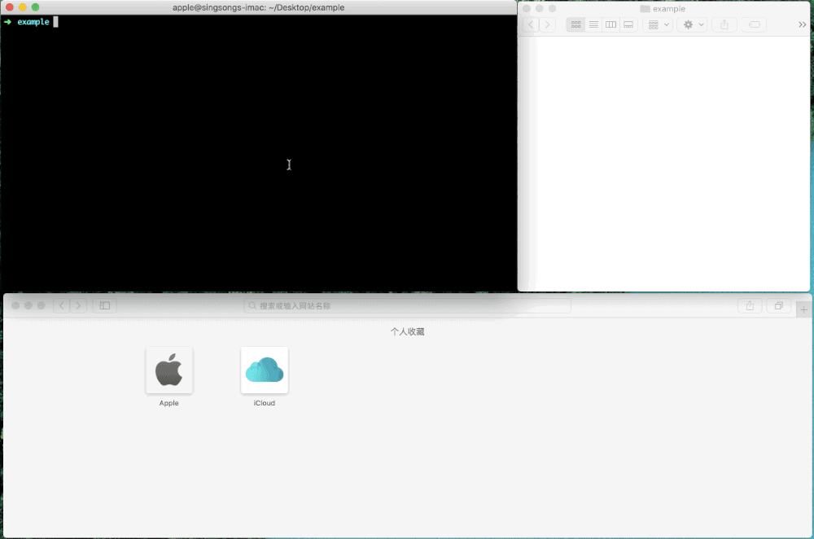
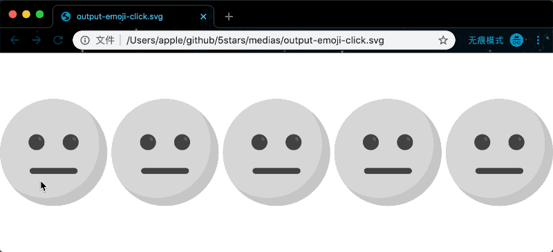

# A quickly generating 5 stars for rating SVG utility tool——5stars



## Try it out

- **`display` mode**

```bash
npx 5stars -a https://raw.githubusercontent.com/zhansingsong/5stars/master/svgs/emoji-a.svg -b https://raw.githubusercontent.com/zhansingsong/5stars/master/svgs/emoji-b.svg -o output-emoji.svg -s 20
```
[output-emoji.svg](./medias/output-emoji.svg)


- **`click` mode**

```bash
npx 5stars -a https://raw.githubusercontent.com/zhansingsong/5stars/master/svgs/emoji-a.svg -b https://raw.githubusercontent.com/zhansingsong/5stars/master/svgs/emoji-b.svg -o output-emoji-click.svg -m click -s 20
```
[output-emoji-click.svg](./medias/output-emoji-click.svg)



