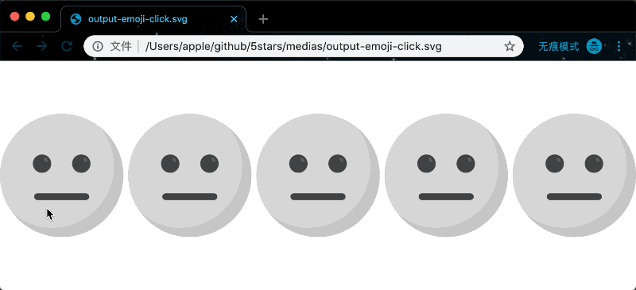

# 5stars

:star::star::star::star::star:

A quickly generating 5 stars for rating based on SVG technique utility tool.

[CHINESE DOC](./README_CN.md)

## Features

- supports `display` and `click` modes.
- optimizes SVG files by [sogo](https://github.com/svg/svgo).
- supports remote url file and local file.
- generates fast.
- supports `configuration` and `cli` usages.

## Warn :warning:

- **normal svg file and active svg file must be the same size, the both files are required as well.**
- **normal svg file and active svg file need to be filled，in order to ensure 'click' mode work.**

## Try it out

- **`display` mode**

```bash
npx 5stars -a https://raw.githubusercontent.com/zhansingsong/5stars/master/svgs/emoji-a.svg -b https://raw.githubusercontent.com/zhansingsong/5stars/master/svgs/emoji-b.svg -o output-emoji.svg -s 20
```
[output-emoji.svg](./medias/output-emoji.svg)


- **`click` mode**

```bash
npx 5stars -a https://raw.githubusercontent.com/zhansingsong/5stars/master/svgs/emoji-a.svg -b https://raw.githubusercontent.com/zhansingsong/5stars/master/svgs/emoji-b.svg -o output-emoji-click.svg -m click -s 20
```
[output-emoji-click.svg](./medias/output-emoji-click.svg)




## Getting started

- If there is the following directory structure: **examples**

  ```bash
  examples
  ├── config.json
  ├── star-active.svg
  └── star-normal.svg
  ```

- config.json

  ```json
  {
    "normal": "star-normal.svg",
    "active": "star-active.svg",
    "space": 0,
    "width": "auto",
    "height": "auto",
    "computeSpace": true,
    "mode": "display",
    "output": "output.svg"
  }
  ```
- run the following command in current directory **examples**

  ```bash
  ➜  examples git:(master) ✗ npx 5stars
  5stars  start generating ...
          complete reading star-active.svg
          complete reading star-normal.svg
          complete creating new symbol element star-a
          complete creating new symbol element star-b
          start to output output.svg
          done!
  ```

- `output.svg`

  

## Usage

```
npx 5stars # use default config.json
npx 5stars -c yourConfigFile
npx 5stars --a star-normal.svg --b star-active.svg
```

- `display` mode

  ```html
  <!-- output.svg -->
  <svg class="5stars-svg" data-width="0.5" id="5stars-svg" xmlns="http://www.w3.org/2000/svg" xmlns:xlink="http://www.w3.org/1999/xlink" width="100%" height="100%"
  viewBox="0 0 309.335 53.867">
    <!-- Generator: 5stars. https://github.com/zhansingsong/5stars -->
    <!-- content -->
  </svg>
  ```
  manipulate `output.svg` how to display by `data-width="0.5"` attribute of the output svg.

  The following output is `data-width="0.7"`:

  

- `click` mode

  ```html
  <svg class="5stars-svg" id="5stars-svg" xmlns="http://www.w3.org/2000/svg" xmlns:xlink="http://www.w3.org/1999/xlink" width="100%" height="100%"
  viewBox="0 0 309.335 53.867">
    <!-- Generator: 5stars. https://github.com/zhansingsong/5stars -->
    <!-- content -->
  </svg>
  ```

  If you want to control when the click operation ends, You can override `window._5stars_click_cb_(n)`:

  ```js
  window._5stars_click_cb_ = function (n) {
    // end click operation when returning true
    return n == 5;
  }
  ```
  **[Example](./examples/click-preview.html)**

  ```html
  <!DOCTYPE html>
  <html lang="en">
  <head>
    <meta charset="UTF-8">
    <meta name="viewport" content="width=device-width, initial-scale=1.0">
    <meta http-equiv="X-UA-Compatible" content="ie=edge">
    <title>5stars click mode</title>
  </head>
  <body>
    <script>
    window._5stars_click_cb_ = function (n) {
      // end click operation when returning true
      return n == 5;
    }
    </script>

    <svg class="5stars-svg" id="5stars-svg" xmlns="http://www.w3.org/2000/svg" xmlns:xlink="http://www.w3.org/1999/xlink"  width="100%" height="100%"
    viewBox="0 0 269.335 53.867">
      <!-- Generator: 5stars. https://github.com/zhansingsong/5stars -->
      <!-- content -->
    </svg>
  </body>
  </html>
  ```

  


## config options

```js
// defaults
const config = {
  // normal svg file
  normal: undefined,
  // active svg file
  active: undefined,
  // space between stars
  space: 0,
  // width of normal and active svg files
  width: 'auto',
  // height of normal and active svg files
  height: 'auto',
  // output path
  output: './output.svg',
  // if space isn't included on computing svg width.
  computeSpace: false,
  // generation mode: display | click
  mode: 'display'
};
```
- **normal**: normal svg file, required.
- **active**: active svg file, required.
- **space**: space between stars.
- **width**: width of normal and active svg files.
- **height**: height of normal and active svg files.
- **output**: output path relative to current directory.
- **computeSpace**: if space isn't included on computing svg width.
- **mode**: generation mode
  - **display**
  - **click**

## CLI

```
Usage: 5stars [options]

Options:
  -v, --version           output the version number
  -c, --config [config]   config file
  -a, --normal [normal]   normal svg file
  -b, --active [active]   active svg file
  -s, --space [space]     space between stars
  --width [width]         width of normal and active svg files
  --height [height]       height of normal and active svg files
  -o, --output [output]   output path
  -m, --mode [mode]       generation mode
  -M, --no-compute-space  if space is not included on computing svg width.
  -h, --help              output usage information

Examples:

  $ 5stars # use default config.json
  $ 5stars -c yourConfig.json
  $ 5stars -a star-normal.svg -b star-active.svg
```

## License

[MIT](LICENSE).
