# 5 星合成新方案

随着移动互联网的飞速发展，硬件设备的不断升级，高清屏幕越来越普及。在开发时，对高清图的要求也越来越高。在制作 5 星评级效果时，也需要考虑高清屏的适配问题。

## 方案 1

1. 将所有的评级情况都制作出来：

   > 来源于大众点评

   

2. 通过 `background-position`、`width`、`height` 来显示不同的评级。

### 实例

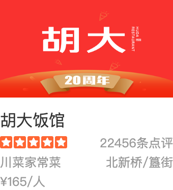
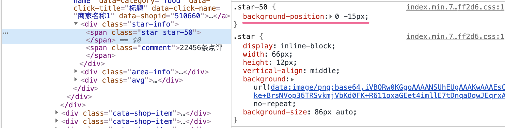

**该方案如何解决高清屏显示问题？**

1. 首先需要准备不同的尺寸 icons，来适配不同的分辨率

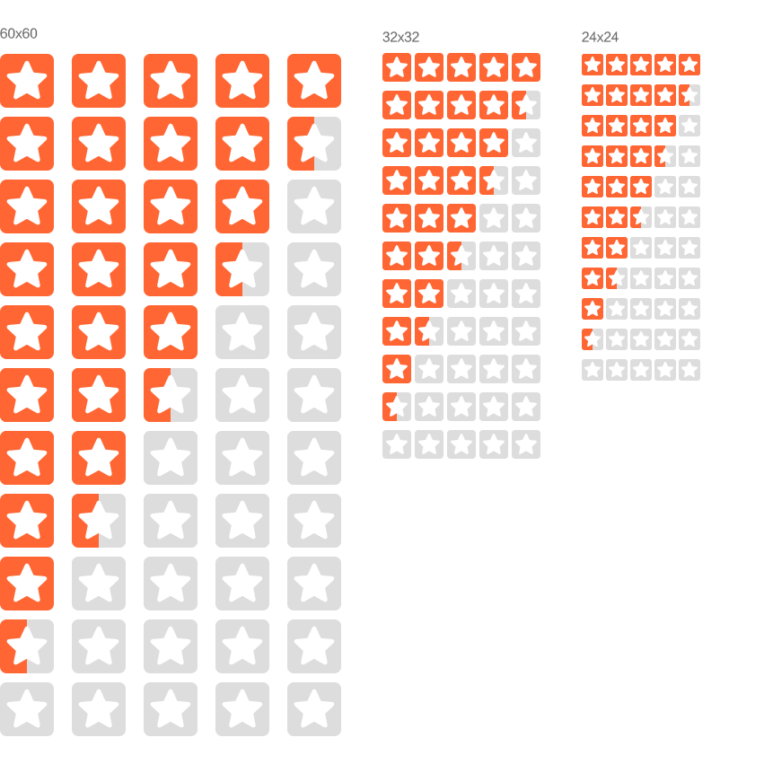

2. 通过 [@media](https://developer.mozilla.org/en-US/docs/Web/CSS/@media) 或 [image-set()](https://developer.mozilla.org/en-US/docs/Web/CSS/image-set) 来使用对应的 icons。

   - [豆瓣](https://movie.douban.com/subject/30318116/?from=showing) 基于 `image-set()` 实践效果图：

   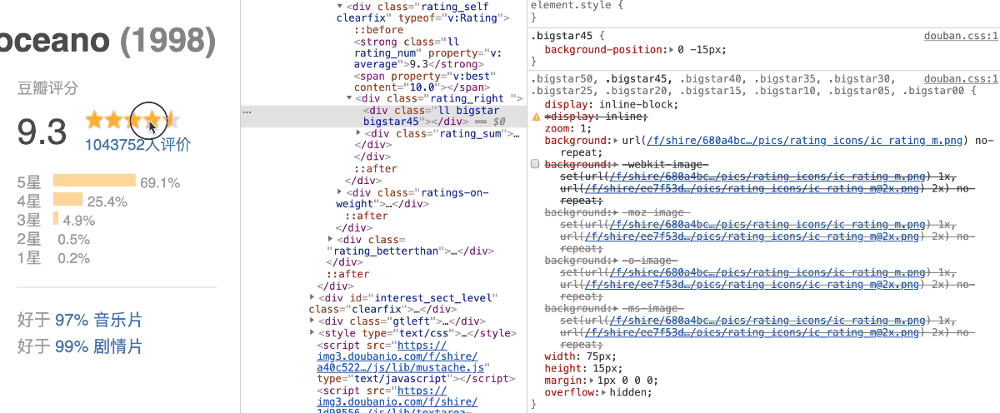

- [Google play](https://play.google.com/store/apps/details?id=com.twitter.android) 基于 `@media` 实践效果图：

  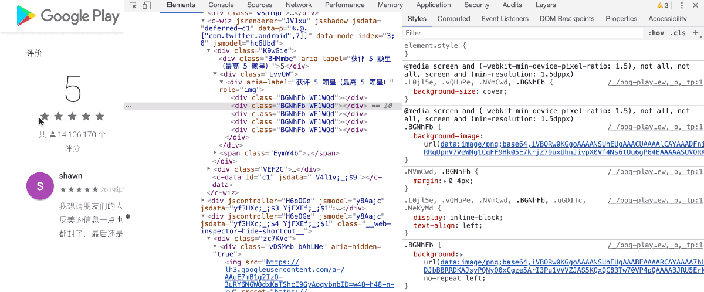

## 方案 2

1. 将 **5 星** 与 **0 星** 合并在一起


2. 通过 `background-position`、`width`、`height` 来显示不同的评级。


另外，如果需要 **半星** 需要提供如下合成图：


### 实例

[Amazon](https://www.amazon.com/gp/product/B07L5WLYG6/?ref=dvm_us_jm_as_imdb_hped215&ref_=imdbref_tt_aiv_tv_i_3&tag=imdb-aiv-tv-20)， [京东(评价)](https://item.jd.com/1467493825.html)， [airbnb](https://zh.airbnb.com/)等都使用了这种方案。

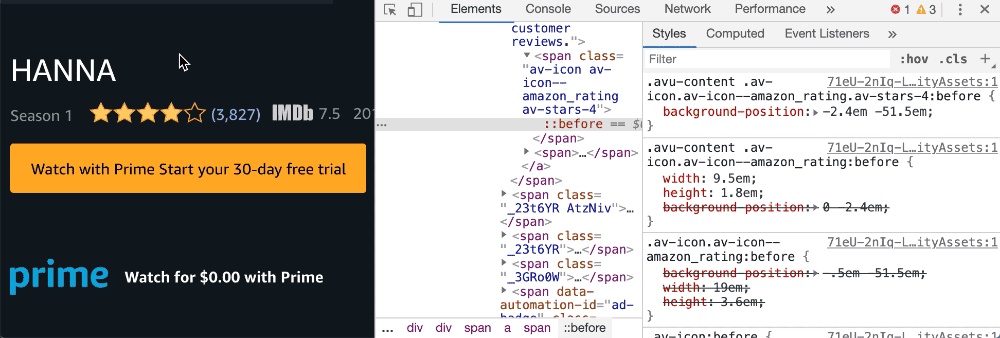

**该方案如何解决高清屏显示问题？**

与 **方案 1** 类似，不再赘述……

## 方案 3

上述 3 种方案只能由** 0 星**、**0.5 星**、**1 星**组合而成。而对于 0.1~0.4 与 0.4~0.9 之间的无法精确表示。接下来介绍的方案可以解决该问题。

1. 构建 5 个 **0 星** 作为底层
2. 构建 5 个 **1 星** 作为显示层
3. 将底层与显示层完全叠加，并且显示层置于底层之上。
4. 控制显示层的宽来显示不同的评级。

原理图如下

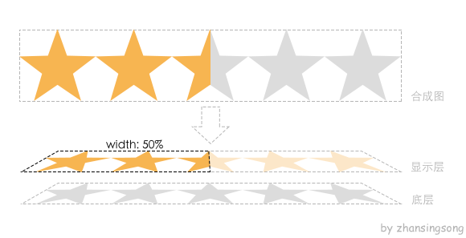

```html
<!-- 底层 -->
<div class="stars-back">
  <!-- 显示层 -->
  <div class="stars-display" style="width: 50%"></div>
</div>
```

```css
.stars-back {
  position: relative;
  height: 20px;
  width: 100px;
  background: url(/images/zero.png) repeat-x 0 0;
  overflow: hidden;
}
.stars-display {
  height: 100%;
  width: 100%;
  background: url(/images/one.png) repeat-x 0 0;
}
```

如何制作显示层或底层？

- 通过图像软件制作输出。
- 使用单元图结合 `background-repeat-x: repeat;`绘制输出。

## 实例

[天猫](https://www.tmall.com/)， [当当](http://www.dangdang.com/)，[苏宁](https://www.suning.com/) 等都使用了这种方案。

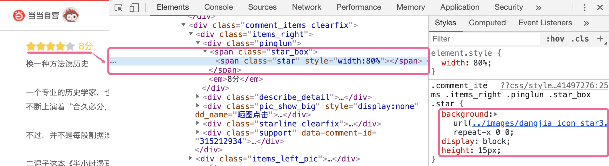

**该方案如何解决高清屏显示问题？**

与 **方案 1** 类似，不再赘述……

## 方案 4

为了解决高清屏显示问题，也有使用 font icon 的解决方案

1. 首先得将 star icon 制作成字体文件。

   

2. 然后引入字体文件，根据评级情况使用不同的 star icon 字体

   ```html
   <!-- 3.5 星 -->
   <div class="stars">
     <i class="iconfont icon-star-one"></i>
     <i class="iconfont icon-star-one"></i>
     <i class="iconfont icon-star-one"></i>
     <i class="iconfont icon-star-half"></i>
     <i class="iconfont icon-star-zero"></i>
   </div>
   ```

   

### 实例

[segmentfault](https://segmentfault.com/) 就使用该技术方案

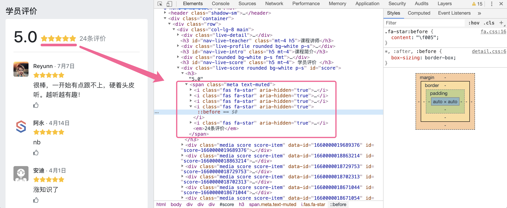

有使用 font icon 也可以使用 SVG，原理与 icon font 类似。直接看 掘金 实例

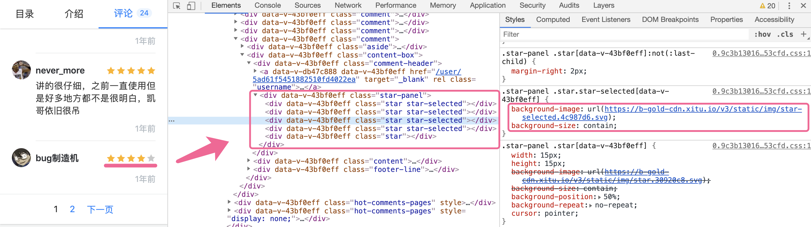

## 方案 5

该方案是 **方案 3** 与 **方案 4** 结合。

1. 使用 font icon 构建 **底层** 和 **显示层**。
2. 通过控制显示层 `width` 来控制评级情况。

关键代码

```html
<!-- 2.5 星 -->
<div class="stars">
  <!-- 底层 -->
  <div class="stars-back">
    <i class="iconfont icon-star-zero"></i>
    <i class="iconfont icon-star-zero"></i>
    <i class="iconfont icon-star-zero"></i>
    <i class="iconfont icon-star-zero"></i>
    <i class="iconfont icon-star-zero"></i>
  </div>
  <!-- 显示层 -->
  <div class="stars-display" style="width: 50%">
    <i class="iconfont icon-star-one"></i>
    <i class="iconfont icon-star-one"></i>
    <i class="iconfont icon-star-one"></i>
    <i class="iconfont icon-star-one"></i>
    <i class="iconfont icon-star-one"></i>
  </div>
</div>
```

### 实例

[美团](https://www.meituan.com/meishi/163046301/) 就使用了这种技术方案。

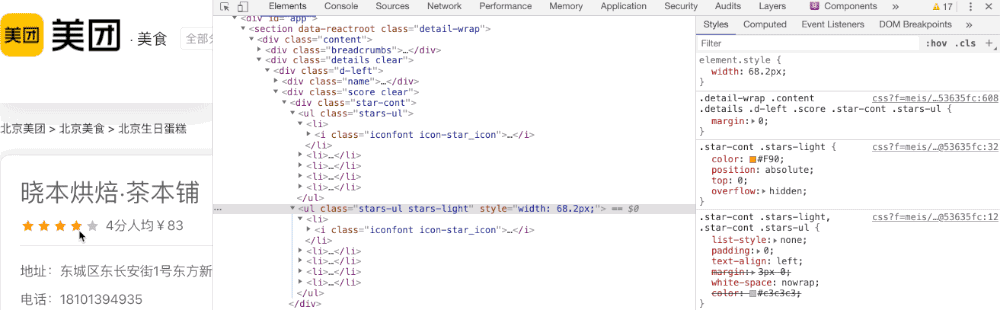

## 方案 6

**5stars** 一个基于 SVG 技术快速生成 5 星好评 的实用工具。更多请查看 [github](https://github.com/zhansingsong/5stars)

## 对比

| 方案 | 间距 | 高清适配                  | width |
| ---- | ---- | ------------------------- | ----- |
| 1    | ❌   | `image-set()` 或 `@media` | ❌    |
| 2    | ❌   | `image-set()` 或 `@media` | ❌    |
| 3    | ❌   | `image-set()` 或 `@media` | ✅    |
| 4    | ✅   | 字体，svg                 | ❌    |
| 5    | ✅   | 字体                      | ✅    |
| 6    | ✅   | svg                       | ✅    |

> singsong： 其他方案欢迎留言补充
